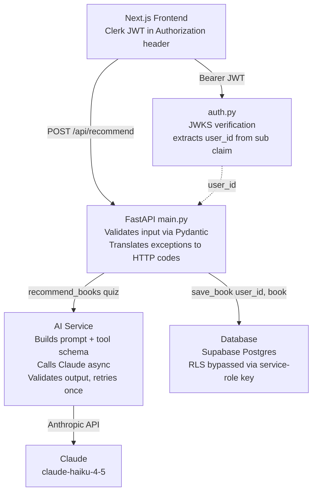

# BooksRec — Backend

> AI-powered book recommendation API. Async FastAPI backend using Anthropic's Claude with tool-calling for guaranteed structured output, Pydantic validation, and retry-on-failure logic.

This is the backend half of BooksRec. The frontend (Next.js + Clerk) lives at [patriceephraim/booksrec-frontend](https://github.com/patriceephraim/booksrec-frontend). Try the live app at **https://booksrec-frontend.vercel.app**.

---

## Why this exists

Most "ChatGPT wrapper" projects parse free-text LLM responses with regex and pray. This project does it the modern way:

- **Tool-use for structured output** — Claude is forced to call a typed function instead of returning prose, eliminating JSON parsing errors.
- **Pydantic validation on both ends** — user input and LLM output are both validated against strict schemas. Invalid data fails loudly with clear errors instead of crashing silently.
- **Service layer isolation** — only `ai_service.py` knows Claude exists. Swapping providers, mocking for tests, or adding caching all happen in one file.
- **Async end-to-end** — non-blocking I/O so the server handles many concurrent users while waiting on Claude.

## Architecture



## Tech stack

- **Python 3.11+**
- **FastAPI** — async web framework with automatic OpenAPI docs
- **Pydantic v2** — runtime data validation
- **Anthropic SDK** — async Claude client with tool use
- **Uvicorn** — ASGI server

## Run it locally

```bash
git clone https://github.com/patriceephraim/booksrec-backend.git
cd booksrec-backend

python3 -m venv venv
source venv/bin/activate          # Windows: venv\Scripts\activate

pip install -r requirements.txt

cp .env.example .env
# Open .env and paste your key from https://console.anthropic.com/

uvicorn app.main:app --reload
```

The API runs at `http://localhost:8000`. Interactive Swagger docs at `http://localhost:8000/docs`.

## Try it

```bash
curl -X POST http://localhost:8000/api/recommend \
  -H "Content-Type: application/json" \
  -d '{
    "favorite_books": ["Project Hail Mary", "The Martian"],
    "preferred_genres": ["scifi"],
    "mood": "escapist",
    "length_preference": "medium",
    "avoid": ["sad endings"]
  }'
```

Returns 3–5 personalized book recommendations, each with a `why_recommended` field that references the user's specific quiz answers.

## API endpoints

| Method | Path | Auth | Description |
|---|---|---|---|
| GET | `/api/health` | No | Liveness check |
| POST | `/api/recommend` | No | Quiz answers → book recommendations |
| GET | `/api/me` | Yes | Returns the authenticated user's Clerk ID |
| POST | `/api/save` | Yes | Save a book to the user's list |
| GET | `/api/saved` | Yes | List saved books for the current user |
| DELETE | `/api/saved/{id}` | Yes | Remove a saved book |
| GET | `/docs` | No | Swagger UI |
| GET | `/redoc` | No | ReDoc UI |

## Project structure

```
booksrec-backend/
  app/
    __init__.py
    main.py          # FastAPI routes — does NOT import anthropic
    models.py        # Pydantic schemas (input + output validation)
    ai_service.py    # The ONLY module that talks to Claude
    config.py        # Env-var loading, fail-fast on missing keys
  .env.example
  .gitignore
  requirements.txt
  README.md
```

## What I learned building this

- **Tool use beats prompt engineering for structured output.** Asking Claude "respond in JSON" gambles on parsing. Defining a tool schema and forcing `tool_choice` makes the SDK's typing guarantees real.
- **The system prompt does most of the personality work.** The line *"generic praise like 'this is a classic' is forbidden — every recommendation must connect to something the user actually said"* is what separates this from a demo.
- **Don't trust the LLM with deterministic data.** Goodreads URLs are built in Python, not generated by Claude — LLMs hallucinate slugs.
- **Async is non-negotiable for LLM apps.** A 3-second sync call blocks every other user. Async releases the thread back to the event loop while waiting on the network.
- **Validate twice — input and output.** FastAPI auto-validates the user's quiz against `QuizAnswers`. My code validates Claude's response against `BookRecommendation`. Both layers fail loudly.
